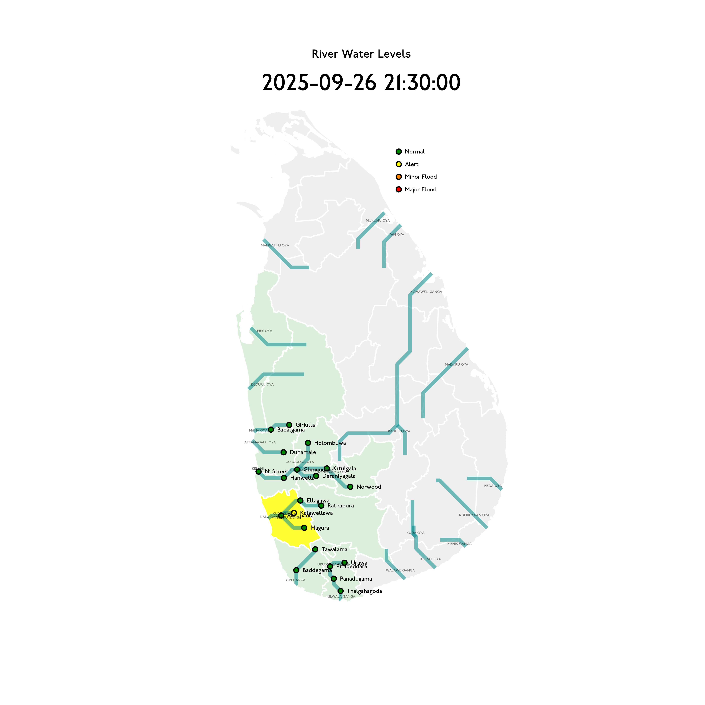

# River Water Levels :sri_lanka:

As posted [https://www.dmc.gov.lk](https://www.dmc.gov.lk)

Last updated **2025-06-16 09:30:00**.

## Alerts (2)

| Level | Station | River | Basin | Rising Rate (mm/hr) | Level (m) | Alert Level (m) | Minor Flood Level (m) | Major Flood Level (m) |
| --: | --: | --: | --: | --: | --: | --: | --: | --: |
| 🟡 Alert | Kalawellawa (Millakanda) | Kuda Ganga | Kalu Ganga (RB 03) | 0  | 6.5 | 5.0 | 6.5 | 8.0 |
| 🟡 Alert | Magura | Maguru Ganga | Kalu Ganga (RB 03) | -100 🡇 | 4.0 | 4.0 | 6.0 | 7.5 |

## Other Stations (37)

| Level | Station | River | Basin | Rising Rate (mm/hr) | Level (m) | Alert Level (m) | Minor Flood Level (m) | Major Flood Level (m) |
| --: | --: | --: | --: | --: | --: | --: | --: | --: |
| 🟢 Normal | Rathnapura | Kalu Ganga | Kalu Ganga (RB 03) | 80 🡅 | 4.8 | 5.2 | 7.5 | 9.5 |
| 🟢 Normal | Panadugama | Nilwala Ganga | Nilwala Ganga (RB 12) | -30 🡇 | 4.5 | 5.0 | 6.0 | 7.5 |
| 🟢 Normal | Putupaula | Kalu Ganga | Kalu Ganga (RB 03) | 10 🡅 | 2.6 | 3.0 | 4.0 | 5.0 |
| 🟢 Normal | Ellagawa | Kalu Ganga | Kalu Ganga (RB 03) | 0  | 8.8 | 10.0 | 10.7 | 12.2 |
| 🟢 Normal | Peradeniya | Mahaweli Ganga | Mahaweli Ganga (RB 60) | 280 🡅 | 4.2 | 5.0 | 7.0 | 9.0 |
| 🟢 Normal | Kithulgala | Kelani Ganga | Kelani Ganga (RB 01) | -70 🡇 | 2.5 | 3.0 | 4.0 | 6.0 |
| 🟢 Normal | Baddegama | Gin Ganga | Gin Ganga (RB 09) | -10 🡇 | 2.9 | 3.5 | 4.0 | 5.0 |
| 🟢 Normal | Thalgahagoda | Nilwala Ganga | Nilwala Ganga (RB 12) | 0  | 1.1 | 1.4 | 1.7 | 2.8 |
| 🟢 Normal | Glencourse | Kelani Ganga | Kelani Ganga (RB 01) | 110 🡅 | 12.1 | 15.0 | 16.5 | 19.0 |
| 🟢 Normal | Norwood | Kehelgamu Oya | Kelani Ganga (RB 01) | 60 🡅 | 1.2 | 1.5 | 3.0 | 4.5 |
| 🟢 Normal | Deraniyagala | Seethawaka Ganga | Kelani Ganga (RB 01) | 1240 🡅 | 3.3 | 4.8 | 5.8 | 6.4 |
| 🟢 Normal | Nawalapitiya | Mahaweli Ganga | Mahaweli Ganga (RB 60) | 30 🡅 | 2.4 | 3.5 | 5.0 | 6.0 |
| 🟢 Normal | Thawalama | Gin Ganga | Gin Ganga (RB 09) | 140 🡅 | 2.7 | 4.0 | 6.0 | 7.5 |
| 🟢 Normal | Dunamale | Attanagalu Oya | Attanagalu Oya (RB 103) | 40 🡅 | 2.2 | 3.3 | 4.4 | 5.5 |
| 🟢 Normal | Badalgama | Maha Oya | Maha Oya (RB 102) | 0  | 2.9 | 5.0 | 6.2 | 9.6 |
| 🟢 Normal | Hanwella | Kelani Ganga | Kelani Ganga (RB 01) | 10 🡅 | 4.0 | 7.0 | 8.0 | 10.0 |
| 🟢 Normal | Holombuwa | Gurugoda Oya | Kelani Ganga (RB 01) | 270 🡅 | 1.4 | 3.0 | 3.4 | 5.0 |
| 🟢 Normal | Nagalagam Street | Kelani Ganga | Kelani Ganga (RB 01) | -91 🡇 | 0.5 | 1.2 | 1.5 | 2.1 |
| 🟢 Normal | Moraketiya | Walawe Ganga | Walawe Ganga (RB 18) | 0  | 1.1 | 3.0 | 5.0 | 7.0 |
| 🟢 Normal | Urawa | Urubokka Ganga | Nilwala Ganga (RB 12) | -50 🡇 | 0.8 | 2.5 | 4.0 | 6.0 |
| 🟢 Normal | Pitabeddara | Nilwala Ganga | Nilwala Ganga (RB 12) | 40 🡅 | 1.3 | 4.0 | 5.0 | 6.5 |
| 🟢 Normal | Giriulla | Maha Oya | Maha Oya (RB 102) | 20 🡅 | 1.8 | 5.5 | 6.5 | 7.5 |
| 🟢 Normal | Horowpothana | Yan Oya | Yan Oya (RB 67) | 0  | 1.6 | 6.0 | 7.5 | 10.5 |
| 🟢 Normal | Thanthirimale | Malwathu Oya | Malwathu Oya (RB 90) | 0  | 1.1 | 5.0 | 6.8 | 7.8 |
| 🟢 Normal | Wellawaya | Kirindi Oya | Kirindi Oya (RB 22) | 0  | 0.9 | 4.4 | 5.4 | 5.9 |
| 🟢 Normal | Moragaswewa | Deduru Oya | Deduru Oya (RB 99) | 20 🡅 | 0.9 | 4.8 | 6.0 | 7.0 |
| 🟢 Normal | Kuda Oya | Kuda Oya | Kirindi Oya (RB 22) | 0  | 1.3 | 6.9 | 8.4 | 8.8 |
| 🟢 Normal | Thanamalwila | Kirindi Oya | Kirindi Oya (RB 22) | 0  | 0.7 | 4.0 | 5.0 | 5.5 |
| 🟢 Normal | Nakkala | Kumbukkan Oya | Kumbukkan Oya (RB 31) | 0  | 0.8 | 5.0 | 6.0 | 7.5 |
| 🟢 Normal | Galgamuwa | Mee Oya | Mee Oya (RB 95) | 0  | 0.7 | 4.8 | 5.9 | 8.0 |
| 🟢 Normal | Yaka Wewa |  | Maa Oya (RB 69) Mukunu Oya | 0  | 0.6 | 4.0 | 5.0 | 6.0 |
| 🟢 Normal | Thaldena | Badulu Oya | Mahaweli Ganga (RB 60) | 30 🡅 | 0.4 | 3.0 | 4.0 | 5.0 |
| 🟢 Normal | Siyambalanduwa | Heda Oya | Heda Oya (RB 36) | 0  | 0.5 | 4.5 | 6.0 | 7.0 |
| 🟢 Normal | Padiyathalawa | Maduru Oya | Maduru Oya (RB 54) | 0  | 0.3 | 4.0 | 4.5 | 6.0 |
| 🟢 Normal | Manampitiya | Mahaweli Ganga | Mahaweli Ganga (RB 60) | 0  | 0.0 | 3.0 | 4.3 | 6.0 |
| 🟢 Normal | Katharagama | Menik Ganga | Menik Ganga (RB 26) | 0  | -0.1 | 4.0 | 4.6 | 6.5 |
| 🟢 Normal | Weraganthota | Mahaweli Ganga | Mahaweli Ganga (RB 60) | -40 🡇 | -3.0 | 5.0 | 6.0 | 8.0 |
